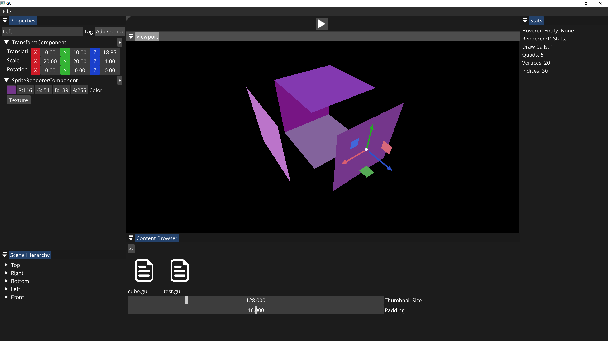

# Gu [](https://github.com/ImGili/GUEngine/blob/master/LICENSE)


# 简介
``GU``是模仿``The Cherno``的``Hazel``引擎， 以``CMake``构建的，无``git submodules``的游戏引擎。

# 克隆项目
外网用户：

```
git clone https://github.com/ImGili/GU.git
```

内网用户：

```
git clone https://gitee.com/ImGili/GU.git
```

# 构建项目
```
mkdir build
cd build
cmake ..
cmake --build ./ --config Release --target GU -j 10
```

# 截图
